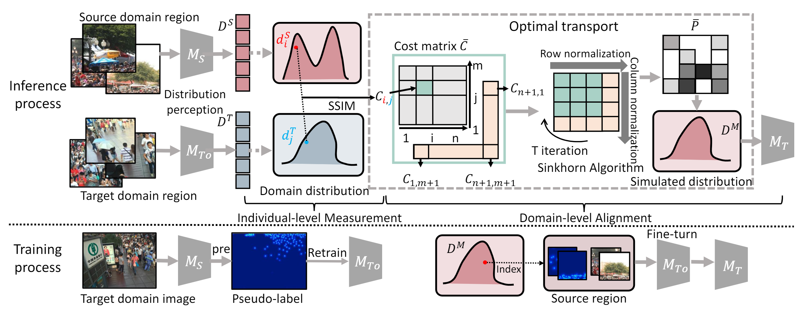

# Domain-Agnostically Aligned Optimal Transport for Domain-Adaptive Crowd Counting
## News
[[Project page](https://github.com/HopooLinZ/DAOT/)] [[paper](https://arxiv.org/abs/2308.05311v1)]   
An officical implementation of "Domain-Agnostically Aligned Optimal Transport for Domain-Adaptive Crowd Counting" (Accepted by ACM MM 2023).   
We propose a novel domain adaption method named DAOT,aligning domain-agnostic factors to bridge the source-target domain gap.
## Overview
Our work proposes a domain-adaptive framework for crowd counting based on optimal transport (OT).
The training process explains the acquisition of 𝑀𝑇0 and 𝑀𝑇, respectively. The inference process is divided into two stages. In the individual-level measurement stage (stage 1), region information from both the source and target domains is collected. The source domain model 𝑀𝑆 and target domain model 𝑀𝑇0 trained with pseudo-labels from 𝑀𝑆 are used for distribution perception, yielding the source domain distribution 𝐷𝑆 and target domain distribution 𝐷𝑇. The distance matrix 𝐶 is calculated using SSIM to measure the distance between each distribution and extended to form the cost matrix 𝐶. In the domain-level alignment stage (stage 2), we use the Sinkhorn algorithm with iterative updates to obtain the optimal transfer matrix solution 𝑃 and the final simulated distribution. We fine-tune the initial model 𝑀𝑇0 using the simulated distribution to obtain the target domain model 𝑀𝑇.

# Visualizations
Visualization results in cross-domain setting involving Q2A, A2B, and A2Q.

# Environment
  As we take FIDT as our baseline ,you can see [[FIDT](https://github.com/dk-liang/FIDTM)] for requirements.
# Datasets
You can download datasets to data folder.
- Download ShanghaiTech dataset from [Baidu-Disk](https://pan.baidu.com/s/15WJ-Mm_B_2lY90uBZbsLwA), passward:cjnx; or [Google-Drive](https://drive.google.com/file/d/1CkYppr_IqR1s6wi53l2gKoGqm7LkJ-Lc/view?usp=sharing)
- Download UCF-QNRF dataset from [here](https://www.crcv.ucf.edu/data/ucf-qnrf/)
- Download JHU-CROWD ++ dataset from [here](http://www.crowd-counting.com/)
- Download NWPU-CROWD dataset from [Baidu-Disk](https://pan.baidu.com/s/1VhFlS5row-ATReskMn5xTw), passward:3awa; or [Google-Drive](https://drive.google.com/file/d/1drjYZW7hp6bQI39u7ffPYwt4Kno9cLu8/view?usp=sharing)
# Generate Ground-Truth

`cd data`   Generate FIDT map : `python fidt_generate_xx.py`     
“xx” means the dataset name,including sh, jhu, qnrf, and nwpu. You should change the dataset path.  

Generate image file list for training or test: `python make_npydata.py `  

# How to train

> #### The model is trained within two stages. 
1. Retrain the model with pseudo lables
    +  run `python pseudo_generate.py `to generate pseudo lables.   
    +  Don't  forget to assign your costumed path like `--save_pseudo` or `--save_pseudo` in config.py  
    +  To have better performance,you can download the pretrained source model from [Baidu-Disk](https://pan.baidu.com/s/1SaPppYrkqdWeHueNlcvUJw), passward:gqqm, or [OneDrive](https://1drv.ms/u/s!Ak_WZsh5Fl0lhCneubkIv1mTllAZ?e=0zMHSM)
    +  run `python train_baseline.py `to retrain the model. Before training,make npy file list like other datasets and check the configuration.

2. FineTune the model with source patches selected by OT
    +  run `slide.py `to divide source images and GT into patches.
    +  run `feature_extract.py` to obtain distribution of source and target domain.
    +  run `oot2.py` to select the best aligned patches from source domain and make the finetune dataset. 
    +  run `python train_baseline.py `to finetune the model. Before training,make npy file list like other datasets and check the configuration.

